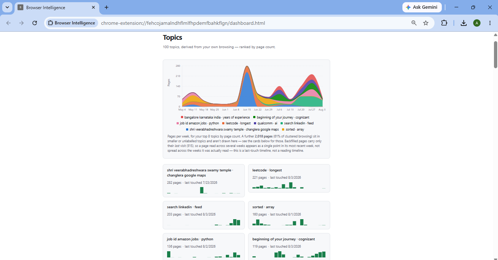

# Browser Intelligence

Your browser remembers where you went; this remembers what you got.

A local-first Chrome extension that turns your browsing history into a
searchable, organized personal knowledge base — entirely on-device. No
account, no server, no data leaving your machine.

**Status: v1.1 complete.** Search, session timeline, topic cards, and the
topics-over-time chart are built and working against a real ~5,900-page
corpus. See [DECISIONS.md](DECISIONS.md) for what's next.

---

## What it does

- **Search your history by meaning, not keywords.** "That article about
  staying calm during interviews" can surface a page titled "5 Tips Before
  Your Technical Round" — Chrome's own history search cannot do this, because
  it only matches strings in titles and URLs.
- **A timeline of your day**, in sessions — "2:10–3:40pm · Docker networking
  · 9 pages" — not a list of timestamps.
- **Topics derived from your own browsing**, not a fixed category list picked
  in advance. Whatever you actually spend time on becomes a topic; nothing
  else does.
- **A chart of which interests rose and fell**, week by week, across your top
  topics by page count.
- **Runs entirely on-device.** Embedding, clustering, and search all happen
  in the extension itself. Nothing is transmitted anywhere, ever.

## Screenshots

<!-- TODO: replace with real captures -->

| Topics over time | Topic grid | Search results |
|---|---|---|
|  |  |  |

## How it works

Four MV3 contexts share one origin, and therefore one IndexedDB — they
communicate through shared storage, not an API layer:

| Context | Role | Runs inference? |
|---|---|---|
| `content` | Injected into visited pages; extracts text via Readability | No |
| `background` | Service worker — alarms, capture queue, routing; torn down after ~30s idle | No |
| `offscreen` | Hidden page with a DOM; hosts the embedding model | **Yes** |
| `dashboard` | The React UI, opened as a normal extension tab | No |

- **Embeddings run on-device**, via `@xenova/transformers` with
  `Xenova/all-MiniLM-L6-v2` (384 dimensions, ~23MB quantized). The weights
  ship inside the extension package; nothing is downloaded at runtime.
- **No network requests, anywhere, by construction.** The Content-Security-
  Policy forbids remote code, and the model loader is explicitly pointed at
  local files only.
- **Storage is IndexedDB.** No vector database — vectors are 384 × 4 bytes
  each, and even 10,000 of them is ~15MB, which loads into memory instantly.
- **Search is a brute-force cosine scan.** Measured, median of three runs:

  | pages | scan time |
  |---|---|
  | 2,670 | 2.17 ms |
  | 5,747 | 4.51 ms |
  | 10,000 | 7.31 ms |
  | 50,000 | 33.67 ms |

  Linear in corpus size, and still under half a frame at 50,000 pages — years
  of realistic browsing. A vector database would be pure overhead.

## Design decisions and tradeoffs

This project keeps a running, measured decision log — including the ideas
that were tried and rejected, with the numbers that killed them. It's linked
throughout this README, and it's worth reading on its own:

**→ [DECISIONS.md](DECISIONS.md)**

A few of the decisions behind what's built:

- **Why no vector database.** See the scan-time table above. A brute-force
  cosine pass over the whole corpus is faster than the overhead a vector
  index would add at this scale, and stays that way for years of browsing.

- **Why topics come from unsupervised clustering, not zero-shot
  classification.** The first design matched each page against ~25 pre-
  embedded category labels ("programming", "finance", "travel"…) and
  accepted anything over a similarity threshold. Measured on 5,374 real
  pages: at the best threshold found, only 13.3% of the corpus classified —
  the rest is exactly where clustering has to pick up the work anyway.
  Lowering the threshold didn't help either: correct-label scores ranged
  0.091–0.473, so no cutoff separated right answers from wrong ones, and
  raising the bar with a margin requirement (ranking, not just a raw score)
  made it worse in a specific way — `Application History | Mynaukri` scored
  0.467 on the label "history" with a 0.277 margin, comfortably clearing
  every threshold considered, purely from the word "History" in the title.
  The structural reason: with ~1,100 LeetCode-style pages in the corpus,
  `3Sum` and `Two Sum` are both about arithmetic and objects, and nothing in
  either title lexically resembles "programming" — a 64-token title has no
  path to that inference. Classification was replaced with the mechanism
  that's actually shipped: unsupervised clustering over the embeddings
  themselves, with the ~25 seed labels demoted to a weak prior that keeps
  day one non-empty and is never shown to the user as a topic.

- **Why no LLM for cluster naming.** Two separate reasons, either one
  sufficient on its own. First, privacy: the 8 titles nearest a cluster's
  centroid are the *most* identifying data in the corpus — a real name, an
  employer shortlist, a job-search timeline — and sending them to a cloud
  model would make this README's central claim false. Second, honesty: an
  early real cluster came out mixing LinkedIn profiles, map lookups, and a
  temple, and its derived label — a plain concatenation of its own words —
  read exactly as badly as the cluster actually was, which is why the
  problem got noticed at all. An LLM handed the same 8 titles would very
  likely produce something plausible-sounding and coherent, smoothing over
  the exact signal that clustering had failed. Naming instead falls back
  through a ladder — an on-device LLM if one is available, otherwise
  class-based keyphrase extraction over the cluster's own titles, otherwise
  the top titles and a count — and a cluster that can't be named stays
  unnamed rather than getting an invented placeholder.

- **Why no backend.** Not an implementation shortcut — the constraint the
  rest of the product is built around. Everything runs client-side; no
  server ever sees your browsing history, because no server exists.

- **Why zero of the originally-planned per-site extractors got built.**
  Three sites were proposed — GitHub, NeetCode, YouTube — each from a single
  observed extraction failure. Measured, all three turned out fine on the
  generic extraction ladder: GitHub repo pages score "good" quality at 82%
  coverage (only profile pages fail, and those are already demoted
  correctly); NeetCode's page metadata carries the actual problem statement;
  YouTube was attempted three separate times and hit three distinct DOM
  failure modes before being dropped for good. The generic, title-and-
  metadata-based extraction ladder handles all three without a bespoke
  adapter, because the adapters were proposed *before* that ladder's
  quality-driven fallback existed — once a bad extraction is detected and
  falls through automatically, the sites that "needed" an adapter mostly
  didn't.

- **Why the search confidence signal is a gradient, not a threshold.**
  Cosine similarity always returns results — it ranks, it doesn't decide
  relevance — so the UI needs some way to hint when nothing really matched.
  The obvious idea (a high top score with a steep drop-off means a real hit;
  a flat profile means nothing did) was measured directly against 10 queries
  with real content and 5 deliberately absent topics, and it's wrong: the
  single steepest score drop-off across all 15 queries belonged to a false
  positive (a search for tax filing matched a page called "Deadline
  Clarification Request," purely on the word "deadline"), while a genuinely
  relevant result scored *lower* than that false positive's own top score.
  No threshold on any measured signal gets both cases right. So there's no
  hidden cutoff and no invented confidence percentage — result cards fade
  continuously with the top match's own score instead, which degrades
  gracefully across exactly the cases where a threshold would snap
  confidently to the wrong answer.

## Known limitations

Stated plainly, because the honest gaps are what make the rest of this
credible:

- **Measures exposure, not understanding.** Reading twenty React articles is
  not knowing React.
- **Helps people who browse with intent.** Pure entertainment has little to
  organize.
- **Value compounds.** Thin in week one; the point is that it isn't thin by
  month six.
- **YouTube is indexed on its description and player chrome, not the
  transcript.** A transcript adapter was built and removed after three
  rounds of DOM failures — videos are still searchable, just by how they
  were described rather than what was said.
- **Chrome's own history retention caps the backfill at ~90 days.** Older
  history is gone before this extension ever sees it.
- **The index is stored unencrypted**, inside your Chrome profile, under the
  same OS permissions as Chrome's own history, saved passwords, and cookies —
  no more, no less. With no user passphrase in the product, any encryption
  key would live in the same profile an attacker already has, so encrypting
  it would be a false promise rather than real protection. Sharing a
  machine? Use a separate Chrome profile — that's a real boundary.
- **Search has no true empty state, and no metric was found that reliably
  detects one.** It always returns results; see "why the search confidence
  signal is a gradient" above for what was measured and why a hard cutoff
  isn't used.
- **Near-duplicate pages can still crowd a result list.** Deliberately —
  the alternative (merging more aggressively) would merge genuinely
  distinct pages.
- **Queries are matched term-by-term, not compositionally**, and more page
  content doesn't fix it — measured directly, embedding more text made
  compositional queries *worse*, not better. This is inherent to the model
  class, not a gap that closes with more engineering.
- **Backfilled sessions reconstruct a last-touch timeline, not a reading
  timeline**, and the difference is undetectable from the data Chrome keeps.
  A page read in May and revisited in July shows up only in July's session.
  Every page in a session really was touched then — this is survivorship
  bias in the timeline, not fabrication — but it does mean older sessions
  are under-represented. Sessions built from live browsing going forward
  don't have this problem.

---

Built phase by phase, with measurement before implementation at every step —
see [DECISIONS.md](DECISIONS.md) for the full record, rejected approaches
included.
